# Production Deployment of a Dockerized Web Application on Amazon EKS with Terraform, Kubernetes, and GitHub Actions

<a id="architecture-diagram"></a>

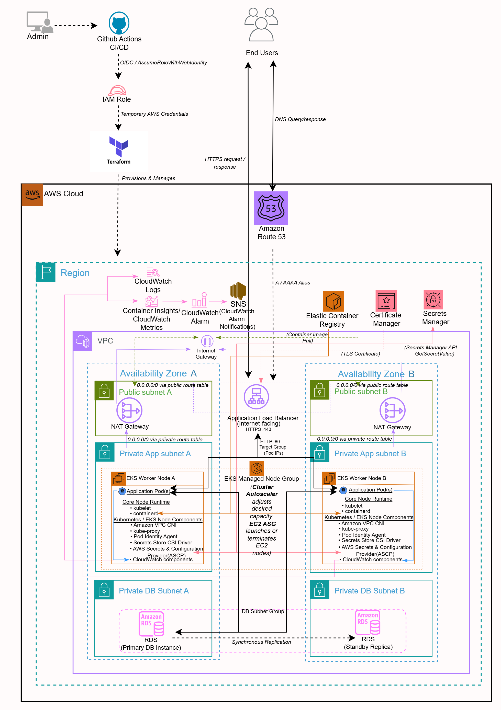

## Project Overview

This project demonstrates how to provision and deploy a Dockerized dynamic web application on Amazon EKS using Terraform, Kubernetes, and GitHub Actions.

The workflow separates foundational networking, the EKS cluster, platform add-ons, application configuration, and application deployment into independently managed stages. GitHub Actions workflows use manual triggers for controlled deployment and destruction, while AWS IAM OpenID Connect provides short-lived AWS credentials without storing long-lived access keys in GitHub.

The deployed application runs on EKS managed node groups in private subnets and is exposed through an internet-facing Application Load Balancer. Route 53 and ExternalDNS manage the application DNS record, AWS Certificate Manager provides HTTPS, AWS Secrets Manager supplies runtime configuration, and Amazon RDS provides the application database.

Application capacity is managed through Kubernetes autoscaling. Horizontal Pod Autoscaler adjusts the number of application Pods based on CPU utilization, while Cluster Autoscaler adjusts the managed node-group capacity when additional Pods cannot be scheduled on the existing worker nodes.

## Table of Contents

1. [Architecture Diagram](#architecture-diagram)
2. [Project Overview](#project-overview)
3. [Services and Technologies](#services-and-technologies)
4. [Key Characteristics](#key-characteristics)
5. [Request Flow](#request-flow)
6. [Deployment and Configuration Flow](#deployment-and-configuration-flow)
7. [Secret Flow](#secret-flow)
8. [Repository Structure](#repository-structure)
9. [Terraform Architecture](#terraform-architecture)
10. [Kubernetes Resources](#kubernetes-resources)
11. [GitHub Actions Workflows](#github-actions-workflows)
12. [Prerequisites](#prerequisites)
13. [Deployment Guide](#deployment-guide)
14. [Troubleshooting Guide](#troubleshooting-guide)
15. [Cost and Operational Considerations](#cost-and-operational-considerations)
16. [Security and Reliability Practices](#security-and-reliability-practices)
17. [Cleanup](#cleanup)
18. [Future Improvements](#future-improvements)


## Services and Technologies

### AWS Services

| AWS service                                        | Purpose                                                           |
| -------------------------------------------------- | ----------------------------------------------------------------- |
| Amazon VPC                                         | Provides isolated multi-AZ networking                             |
| Amazon EKS                                         | Provides the managed Kubernetes control plane                     |
| Amazon ECR                                         | Stores versioned Docker images                                    |
| Amazon RDS                                         | Hosts the application database restored from a snapshot           |
| AWS Secrets Manager                                | Stores application and database configuration                     |
| Elastic Load Balancing – Application Load Balancer | Routes HTTPS traffic to the application                           |
| Amazon Route 53                                    | Hosts the application DNS zone                                    |
| AWS Certificate Manager                            | Provides the TLS certificate used by the ALB                      |
| Amazon CloudWatch                                  | Collects cluster, node, Pod, container, and application telemetry |
| Amazon SNS                                         | Delivers CloudWatch alarm notifications                           |

### Amazon EKS Features and AWS Integrations

| Feature or integration                 | Purpose                                                               |
| -------------------------------------- | --------------------------------------------------------------------- |
| EKS managed node groups                | Run application and platform Pods on managed EC2 worker nodes         |
| EKS Pod Identity                       | Provides AWS IAM permissions to Kubernetes service accounts           |
| AWS Load Balancer Controller           | Creates and manages AWS load balancers from Kubernetes resources      |
| AWS Secrets and Configuration Provider | Retrieves AWS Secrets Manager values for the Secrets Store CSI Driver |

### Kubernetes Components and Add-ons

| Component                 | Purpose                                                              |
| ------------------------- | -------------------------------------------------------------------- |
| ExternalDNS               | Creates and updates Route 53 DNS records from Kubernetes resources   |
| Horizontal Pod Autoscaler | Adjusts application replica count based on resource utilization      |
| Metrics Server            | Supplies CPU and memory metrics to Kubernetes autoscaling components |
| Cluster Autoscaler        | Adjusts managed node-group capacity based on Pod scheduling demand   |
| Secrets Store CSI Driver  | Mounts external secrets into Pods                                    |

### DevOps and Application Technologies

| Technology     | Purpose                                                                                                                                        |
| -------------- | ---------------------------------------------------------------------------------------------------------------------------------------------- |
| Terraform      | Provisions and manages AWS infrastructure and platform add-ons                                                                                 |
| GitHub Actions | Runs build, deployment, verification, and destruction workflows                                                                                |
| Docker         | Packages the application and its runtime dependencies into container images                                                                    |
| Kubernetes     | Defines and manages the application's namespace, service account, secret provider, Deployment, Service, Ingress, and Horizontal Pod Autoscaler |

## Key Characteristics

- Multi-AZ VPC with public, private application, and private database subnets
- EKS managed node group running in private application subnets
- Internet-facing ALB spanning public subnets
- AWS Load Balancer Controller for provisioning and managing the application ALB from Kubernetes Ingress resources
- RDS database restored from an existing snapshot
- ECR repository with image scanning and immutable image tags
- GitHub Actions authentication through AWS IAM OIDC
- Separate Terraform state for bootstrap, foundation, EKS, and platform layers
- S3 native state locking with `use_lockfile = true`
- Kubernetes secrets mounted from AWS Secrets Manager through the Secrets Store CSI Driver
- Horizontal Pod Autoscaler for CPU-based application replica scaling
- Metrics Server integration for Kubernetes resource metrics
- Cluster Autoscaler for managed node-group capacity scaling
- EKS Pod Identity for supported add-ons and application workloads
- ExternalDNS integration with Route 53
- HTTPS listener and HTTP-to-HTTPS redirect through ACM and the ALB
- Pre-existing domain name hosted in Amazon Route 53 and a TLS certificate issued by AWS Certificate Manager (ACM)
- CloudWatch observability, Container Insights, alarms, and SNS notifications
- Manual `workflow_dispatch` workflows for controlled operations
- Ordered deployment and destruction workflows


### Request Flow

```text
User
  |
  | HTTPS
  v
Route 53
  |
  v
Internet-facing Application Load Balancer
  |  HTTP 80 redirects to HTTPS 443
  |  HTTPS 443 forwards to Kubernetes Service targets
  v
Amazon EKS
  |
  | Pods run on managed EC2 worker nodes in private application subnets
  v
Dockerized Application
  |
  v
Amazon RDS in private database subnets
```

### Deployment and Configuration Flow

```text
GitHub Actions
  |
  | AWS IAM OIDC
  v
AWS Deployment Role
  |
  +--> Terraform Foundation
  |      VPC, subnets, routing, NAT, ECR, RDS, Secrets Manager container
  |
  +--> Terraform EKS Setup
  |      EKS control plane, node group, access entries
  |
  +--> Terraform Platform
  |      Pod Identity Agent, CSI Driver, ASCP, ALB Controller,
  |      ExternalDNS, autoscaling, metrics, and observability
  |
  +--> Application Workflows
         Build image, populate secret, render manifests, deploy to EKS
```

### Secret Flow

```text
GitHub Environment Secrets
  |
  v
Populate Application Secret Workflow
  |
  v
AWS Secrets Manager
  |
  | EKS Pod Identity
  v
AWS Secrets and Configuration Provider
  |
  v
Secrets Store CSI Driver
  |
  +--> Mounted secret volume
  +--> Synchronized Kubernetes Secret
          |
          v
       Pod environment variables
```


## Repository Structure

```text
project-root/
├── .github/
│   └── workflows/                            # GitHub Actions CI/CD workflows                     
│       ├── 1-foundation.yml
│       ├── 2-build-and-push-docker-image.yml
│       ├── 3-eks.yml
│       ├── 4-platform-addons.yml
│       ├── 5-populate-secrets.yml
│       └── 6-deploy-application.yml
├── images/
│   ├── architecture-image/                   # Architecture diagram used in the README
│   └── screenshots/                          # Deployment and verification screenshots
├── kubernetes/                               # Kubernetes manifests for the application workload
│   └── application/
│       ├── 00-namespace.yaml
│       ├── 10-service-account.yaml
│       ├── 20-secret-provider-class.yaml
│       ├── 30-deployment.yaml
│       ├── 40-service.yaml
│       ├── 50-ingress.yaml
│       └── 60-horizontal-pod-autoscaler.yaml
├── rentzone/                                  # Laravel application and container build context
│   ├── Dockerfile
│   ├── AppServiceProvider.php
│   └── rentzone.zip                           # Application source files
├── terraform/                                 # Infrastructure as code
│   ├── bootstrap/
│   ├── foundation/
│   ├── eks-setup/
│   └── platform/
├── .gitignore
└── README.md                                  # Project documentation and deployment instructions
```

## Terraform Architecture

This project uses four Terraform root modules. Each root has a separate responsibility and a separate state file.

### 1. `terraform/bootstrap/`

The bootstrap root is run locally before the GitHub Actions workflows. It creates:

- S3 bucket for Terraform remote state
- S3 server-side encryption
- S3 public-access block
- Bucket policy requiring HTTPS
- GitHub Actions OIDC provider
- GitHub deployment IAM role and trust policy

### 2. `terraform/foundation/`

The foundation root creates shared infrastructure:

- VPC
- Two public subnets for the ALB and NAT Gateways
- Two private application subnets for EKS worker nodes
- Two private database subnets for RDS
- Internet Gateway
- Two NAT Gateways
- Public and private route tables
- RDS security group
- DB subnet group
- RDS instance restored from a snapshot
- ECR repository
- Secrets Manager application secret container

### 3. `terraform/eks-setup/`

The EKS root reads the foundation state and creates:

- EKS cluster IAM role
- EKS managed cluster
- Worker-node IAM role
- EKS managed node group
- EKS access entry for the GitHub deployment role
- Cluster-admin access policy association for the deployment role
- RDS ingress rules that permit database traffic from the EKS environment

### 4. `terraform/platform/`

The platform root reads the EKS state and installs cluster services:

- EKS Pod Identity Agent
- Secrets Store CSI Driver
- AWS Secrets and Configuration Provider
- AWS Load Balancer Controller
- ExternalDNS
- Metrics Server
- Cluster Autoscaler
- CloudWatch Observability add-on
- Container Insights
- SNS topic and email subscription
- CloudWatch alarms

## Terraform State Management

The project uses one S3 bucket with separate object keys for each Terraform root.

Example keys:

```text
production/foundation/terraform.tfstate
production/eks/terraform.tfstate
production/platform/terraform.tfstate
```

Each root that writes state initializes its S3 backend with native S3 locking:

```hcl
terraform {
  backend "s3" {
    use_lockfile = true
  }
}
```

The backend values are supplied during `terraform init`:

```bash
terraform init \
  -backend-config="bucket=${TF_STATE_BUCKET}" \
  -backend-config="key=${TF_STATE_KEY}" \
  -backend-config="region=${AWS_REGION}" \
  -backend-config="encrypt=true" \
  -backend-config="use_lockfile=true"
```
## Kubernetes Resources

The application manifests are applied in numerical order.

### `00-namespace.yaml`

This creates the application namespace.

### `10-service-account.yaml`

This manifest creates the application service account associated with EKS Pod Identity.

### `20-secret-provider-class.yaml`

This defines the AWS secret, JSON key mappings, and synchronized Kubernetes Secret.

### `30-deployment.yaml`

This manifest defines:

- Two application replicas
- Immutable ECR image URI
- Application service account
- Secret environment injection
- CSI secret volume mount
- Resource requests and limits
- Startup, readiness, and liveness probes

### `40-service.yaml`

This manifest creates a `ClusterIP` Service for the application Pods.

### `50-ingress.yaml`

This manifest creates an ALB-backed Ingress with:

- Internet-facing scheme
- HTTPS listener on port 443
- HTTP-to-HTTPS redirect from port 80
- ACM certificate
- Public application hostname
- ExternalDNS hostname annotation
- ALB target type appropriate for the Kubernetes Service design


> The two public subnets created in `terraform/foundation/vpc` are tagged with `"kubernetes.io/role/elb" = "1"` while the two private application subnets are tagged with `"kubernetes.io/role/internal-elb" = "1"`.
These tags allow the AWS Load Balancer Controller to distinguish between subnets intended for internet-facing and internal load balancers during subnet auto-discovery. Because the application Ingress uses `alb.ingress.kubernetes.io/scheme: internet-facing` and does not explicitly specify subnet IDs, the controller automatically discovers the eligible public subnets for the Application Load Balancer.

### `60-horizontal-pod-autoscaler.yaml`

This manifest creates a Kubernetes Horizontal Pod Autoscaler that automatically adjusts the number of application Pods based on average CPU utilization.

The HPA is configured with:

- The application Deployment as its scaling target
- A minimum of 2 application Pods
- A maximum of 6 application Pods
- A target average CPU utilization of 60%
- Immediate scale-up evaluation
- A five-minute scale-down stabilization window
- Controlled scale-up and scale-down rates to reduce abrupt capacity changes

When CPU utilization exceeds the target, the HPA can add up to two Pods or double the replica count within 60 seconds. When demand decreases, it waits five minutes before reducing replicas by up to 50% per minute.

The HPA requires Metrics Server and CPU resource requests. After handing off the replica ownership to the HPA, the Deployment manifest should not define `spec.replicas`, allowing the HPA to control the live replica count.

If additional Pods cannot fit on existing nodes, the Cluster Autoscaler can increase the managed node-group capacity within its configured limits. `.github/workflows/3-eks.yml` specifies a minimum of 2 nodes and a maximum of 4 nodes.

## Platform Add-on Notes

### Secrets Store CSI Driver and ASCP

The CSI Driver and AWS provider are installed as separate Helm releases.

The ASCP chart must not install a second copy of the CSI Driver:

```hcl
values = [
  yamlencode({
    "secrets-store-csi-driver" = {
      install = false
    }
  })
]
```

The independently installed CSI Driver must request the AWS token audiences required by the provider and EKS Pod Identity:

```hcl
values = [
  yamlencode({
    tokenRequests = [
      {
        audience = "sts.amazonaws.com"
      },
      {
        audience = "pods.eks.amazonaws.com"
      }
    ]
  })
]
```

Secret synchronization and rotation are enabled through the CSI Driver Helm values.

### ExternalDNS

ExternalDNS uses the Route 53 hosted-zone suffix as its domain filter:

```hcl
domainFilters = [
  var.hosted_zone_name
]
```

For example:

```text
Hosted zone:  example.com
Ingress host: www.example.com
```

ExternalDNS detects the Ingress hostname and creates or updates the `www.example.com` DNS record in the `example.com` Route 53 hosted zone.

### AWS Load Balancer Controller

For the AWS Load Balancer Controller to distinguish between subnets intended for internet-facing and internal load balancers during subnet auto-discovery, public subnets have the tag:

```text
kubernetes.io/role/elb = 1
```

while private application subnets  have the tag:

```text
kubernetes.io/role/internal-elb = 1
```


### Cluster Autoscaler

The Cluster Autoscaler minor version should match the Kubernetes minor version of the EKS cluster. In this project, the EKS cluster runs Kubernetes `1.35`, so the Cluster Autoscaler uses a `v1.35.2` release.

When upgrading the EKS cluster to a new Kubernetes minor version, update the Cluster Autoscaler image (`TF_VAR_cluster_autoscaler_image_tag` in `.github/workflows/4-platform-addons.yml`) to the corresponding minor version as part of the same upgrade.

## GitHub Actions Workflows

The workflows use `workflow_dispatch` to make infrastructure operations deliberate and auditable.

### Workflow 1. Deploy Foundation Infrastructure on AWS

Workflow file:

```text
.github/workflows/1-foundation.yml
```

Responsibilities:

- Authenticate to AWS through OIDC
- Initialize the foundation Terraform state
- Run Terraform validation and planning
- Apply or destroy the foundation layer
- Output values required by later stages


### Workflow 2. Build and Push the Docker Image

Workflow file:

```text
.github/workflows/2-build-and-push-docker-image.yml
```

Responsibilities:

- Authenticate to AWS through GitHub OpenID Connect (OIDC)
- Sign in to Amazon ECR
- Build the application image using `rentzone/Dockerfile`
- Tag the image with the immutable image tag supplied when the workflow is launched
- Push the tagged image to the Amazon ECR repository
- Verify that the image and tag were successfully published to ECR


### Workflow 3. Deploy EKS Infrastructure

Workflow file:

```text
.github/workflows/3-eks.yml
```

Responsibilities:

- Initialize the EKS Terraform configuration with its dedicated remote state
- Read the required VPC, subnet, security-group, and database outputs from the foundation Terraform state
- Create or destroy the Amazon EKS cluster and managed node group
- Configure GitHub Actions access to the cluster through an EKS access entry and associated access policy
- Generate the Kubernetes configuration required by `kubectl`
- Verify that the EKS cluster is active and the worker nodes are registered and ready

### Workflow 4. Install the EKS Platform Add-ons

Workflow file:

```text
.github/workflows/4-platform-addons.yml
```

Responsibilities:

- Initialize the EKS Terraform configuration and read the cluster name from its remote state
- Configure `kubectl` access to the EKS cluster
- Create or destroy the platform add-ons managed by the platform Terraform root
- Verify the readiness of the installed controllers, EKS add-ons, Deployments, and DaemonSets

> The workflow retrieves the cluster name directly from the existing EKS Terraform state before initializing the platform Terraform configuration to prevent the first platform deployment from depending on platform outputs that do not yet exist.

> The workflow recreates the Cluster Autoscaler and ExternalDNS Pods after their EKS Pod Identity associations are created, ensuring that newly created Pods receive the required Pod Identity credentials after AWS eventual consistency delays.

### Workflow 5. Populate the Application Secret

Workflow file:

```text
.github/workflows/5-populate-secrets.yml
```

Responsibilities:

- Initialize the foundation Terraform configuration and read the RDS endpoint, database port, and application secret ARN from remote state
- Combine the infrastructure outputs with the database credentials stored as GitHub Environment secrets
- Construct the application configuration as a JSON object
- Write the completed JSON object to AWS Secrets Manager
- Verify that the secret contains the expected application and database configuration keys


Application Secret Schema:

This workflow writes a JSON object similar to:

```json
{
  "APP_NAME": "example-application",
  "APP_ENV": "production",
  "APP_URL": "https://www.example.com",
  "DB_HOST": "database.example.us-east-1.rds.amazonaws.com",
  "DB_PORT": "3306",
  "DB_DATABASE": "application_database",
  "DB_USERNAME": "application_user",
  "DB_PASSWORD": "replace-with-secret-value"
}
```
> Environment-variable names are application-specific. The secret key names must exactly match the environment variables expected by the deployed application.  For example, Laravel — the framework used by this application — normally expects `DB_DATABASE`, while other applications or container images may use variables such as `DB_NAME`, `WORDPRESS_DB_NAME`, `MYSQL_DATABASE`, or `POSTGRES_DB`.

The `SecretProviderClass` maps each AWS Secrets Manager key to the corresponding key in the synchronized Kubernetes Secret so the application receives the expected environment-variable names.


### Workflow 6. Deploy the EKS Application

Workflow file:

```text
.github/workflows/6-deploy-application.yml
```

Manual inputs:

```text
operation: deploy or destroy
image_tag: required for deploy and ignored for destroy
```

Responsibilities:

- Validate the required configuration before modifying live Kubernetes resources
- Read the EKS cluster name, ECR repository URL, application secret ARN, namespace, and service-account values from Terraform remote state
- Configure kubectl access to the EKS cluster
- Verify that the required platform components are available
- Verify that the requested image tag exists in Amazon ECR
- Verify that the application secret exists in AWS Secrets Manager
- Render the Kubernetes manifests with envsubst during deployment
- Validate the rendered YAML before applying it to the cluster
- Apply the Kubernetes manifests in dependency order
- Deploy and verify the Horizontal Pod Autoscaler
- Wait for the application Deployment to complete its rollout
- Verify that the Ingress receives an Application Load Balancer hostname
- Verify that the application domain resolves to the load balancer
- Delete application resources in reverse dependency order during destroy

The complete container image URI is derived during deployment as:

```text
${ECR_REPOSITORY_URL}:${IMAGE_TAG}
```

For example:

```text
123456789012.dkr.ecr.us-east-1.amazonaws.com/example-application:v1
```
The workflow rejects an empty image_tag when the deploy operation is selected. Without this validation, the generated Deployment manifest could contain an invalid image reference ending with a trailing colon:

```text
123456789012.dkr.ecr.us-east-1.amazonaws.com/example-application:
```

This malformed value can cause YAML-parsing or container-image validation errors.

During the destroy operation, the image tag is not required. The workflow skips image verification, secret verification, manifest rendering, and deployment validation, then deletes the Kubernetes resources directly by name. This allows the application to be removed without generating an unnecessary or invalid container image URI.

## Prerequisites

- AWS account with permission to create the required resources
- Existing Route 53 public hosted zone
- Existing validated ACM certificate in the application region
- Existing RDS snapshot
- GitHub repository
- GitHub Environment for deployment variables and secrets
- AWS CLI
- Terraform
- Docker
- Git
- `kubectl`
- Helm
- Local AWS CLI profile with sufficient permissions to deploy the bootstrap Terraform root, including creating and configuring the required IAM and S3 resources.

For Windows environments, PowerShell can be used to run the local bootstrap and validation commands.

## DEPLOYMENT GUIDE
## PHASE A. Initial Bootstrap

Run the bootstrap Terraform root locally before using the GitHub Actions workflows.

### 1. Get GitHub Owner and Repository IDs

The AWS IAM OIDC role trust policy must match the GitHub Environment subject generated by the workflows. By default, repositories created after July 15, 2026 use the immutable format:

`repo:OWNER@OWNER_ID/REPOSITORY@REPOSITORY_ID:environment:ENVIRONMENT`

- Authenticate with the GitHub CLI:

```powershell
gh auth login
```

- Set the repository owner and name:

```powershell
$OWNER="<GITHUB_USERNAME_OR_ORGANIZATION>" $REPOSITORY="<GITHUB_REPOSITORY_NAME>"
```

- Retrieve both numeric owner and repository IDs:

```powershell
$R=gh api "repos/$OWNER/$REPOSITORY" | ConvertFrom-Json; "github_owner_id = $($R.owner.id)"; "github_repository_id = $($R.id)"
```

Example output:

```text
github_owner_id = 12345678
github_repository_id = 987654321
```

Use the numeric `id` values, not the GraphQL `node_id` values.

### 2. Create the Bootstrap `terraform.tfvars` File

- Create `terraform/bootstrap/terraform.tfvars`

- Add the following values:

```hcl
# AWS region where the bootstrap resources will be created.
# Example: "us-east-1"
aws_region = ""

# Name of the AWS CLI profile used to authenticate locally.
# Example: "exampleprofile"
aws_profile = ""

# Base name used when naming AWS resources.
project_name = "rentzone-eks"

# Deployment environment used in resource names and tags.
# Examples: "dev", "staging", or "prod"
environment = "prod"

# GitHub account or organization that owns the repository.
# Example: "lynkolds"
github_owner = ""

# Permanent numeric GitHub ID assigned to the repository owner
# Use the owner.id value returned by the GitHub REST API.
# Example: 12345678
github_owner_id =

# GitHub repository that will run the deployment workflows.
# Enter only the repository name, not the complete GitHub URL.
# Example: "aws-eks-dynamic-web-app-deployment"
github_repository = ""

# Permanent numeric GitHub ID assigned to the repository. 
# Use the repository id returned by the GitHub REST API. 
# Example: 987654321
github_repository_id = 

# GitHub Environment used by the workflows.
# This value must exactly match the environment name configured in GitHub.

# Example: "dev"
github_environment_name = ""
```

### 3. Initialize and Apply the Bootstrap Infrastructure

- Open `terraform/bootstrap/` in an integrated terminal and run the following commands.

```powershell
terraform init
terraform plan
terraform apply
```

- Record the outputs, especially `terraform_state_bucket_name` and `aws_deployment_role_arn`.

These values will be added to the GitHub Environment variables as `TF_STATE_BUCKET` and `AWS_DEPLOYMENT_ROLE_ARN`.


## PHASE B. GitHub Environment Configuration

### 1. Create a GitHub Environment. 

The environment name must match both the `github_environment_name` value defined in `terraform/bootstrap/terraform.tfvars` and the `environment` value specified in each GitHub Actions workflow.

For example:

```hcl
github_environment_name = "dev"
```

```yaml
environment: dev
```

### 2. Create environment Secrets

```text
DATABASE_NAME
DATABASE_USERNAME
DATABASE_PASSWORD
```

Since the RDS instance is restored from a snapshot, use the database name, username and password associated with the database contained in the snapshot.

Note that these values are written to AWS Secrets Manager by the `Populate Application Secret` workflow. They are not Terraform variables and should not be committed to the repository.

### 3. Create environment Variables

```text
AWS_REGION                   # AWS region used to deploy and manage the project resources.
AWS_DEPLOYMENT_ROLE_ARN      # ARN of the IAM role assumed by GitHub Actions through
                             # OpenID Connect. 
                                # This is an output from the terraform/boostrap/ local run
PROJECT_NAME                 # Base project name used when naming and tagging 
                             # AWS resources.
ENVIRONMENT                  # Deployment environment, such as dev, staging, or prod.

TF_STATE_BUCKET              # S3 bucket used to store the Terraform remote state files.
                                # This is an output from the terraform/boostrap/ local run
TF_FOUNDATION_STATE_KEY      # S3 object key for the foundation infrastructure
                             # Terraform state.
                                # Example: production/foundation/terraform.tfstate  
TF_EKS_STATE_KEY             # S3 object key for the EKS cluster Terraform state.
                                # Example: production/eks/terraform.tfstate  
TF_PLATFORM_STATE_KEY        # S3 object key for the EKS platform add-ons Terraform state.
                                # Example: production/platform/terraform.tfstate  

ECR_REPOSITORY_NAME          # Name of the Amazon ECR repository used to store application 
                             # container images
                                # This is an output from the foundation workflow job
KUBERNETES_VERSION           # Kubernetes version used when creating the Amazon EKS cluster.
                                # This project uses "1.35".

DATABASE_SNAPSHOT_IDENTIFIER # Name of the RDS snapshot used to restore the application database
DATABASE_INSTANCE_IDENTIFIER # Identifier assigned to the restored Amazon RDS database instance.
DATABASE_INSTANCE_CLASS      # RDS instance class that determines the database
                             # compute and memory capacity.

APP_NAME                     # Application name stored in Secrets Manager and injected into the application.
DOMAIN_NAME                  # Complete application hostname, including the subdomain, 
                             # such as www.example.com. 
                                # This is used by the Ingress
HOSTED_ZONE_NAME             # Route 53 hosted-zone domain without the application subdomain, 
                             # such as example.com. 
                                # This is the Route 53 hosted-zone suffix used by ExternalDNS created by the platform-addons workflow.
HOSTED_ZONE_ID               # ID of the existing Route 53 hosted zone managed by ExternalDNS.
CERTIFICATE_ARN              # ARN of the issued ACM certificate used by the ALB HTTPS listener.

SNS_EMAIL                                   # Email address for SNS notifications 
                                            # for CloudWatch alarms.
CLOUDWATCH_OBSERVABILITY_ADDON_VERSION      # Version of the Amazon CloudWatch Observability 
                                            # EKS add-on to install.
                                                # This project uses "v6.3.0-eksbuild.1".
```

> `CLOUDWATCH_OBSERVABILITY_ADDON_VERSION` must be compatible with the selected Kubernetes version and AWS Region. Do not copy an example add-on version without verifying compatibility.

If your deployment does not use Kubernetes `1.35` in `us-east-1`, replace those values in the command below.

Use this PowerShell command to retrieve the current default compatible version of the Amazon CloudWatch Observability add-on:

```powershell
aws eks describe-addon-versions --addon-name amazon-cloudwatch-observability --kubernetes-version 1.35 --region us-east-1 --query 'addons[0].addonVersions[?compatibilities[?defaultVersion==`true`]].addonVersion | [0]' --output text
```

## PHASE C: Workflow Run

Run the workflows in this order because each stage depends on outputs or services created by the previous stages.

```text
1. Deploy Foundation Infrastructure on AWS
2. Build and Push Docker Image
3. Deploy EKS Infrastructure
4. Install EKS Platform Add-ons
5. Populate Application Secret
6. Deploy EKS Application
```

## Deployment Procedure

### Step 1: Deploy Foundation

- Run **Deploy Foundation Infrastructure on AWS** with the `apply` operation.

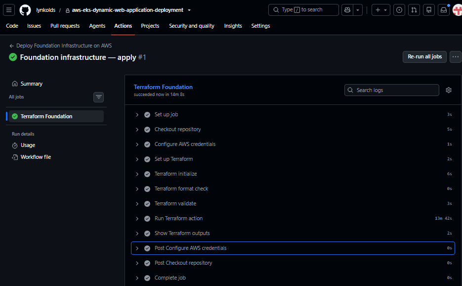

- Note the `ecr_repository_name` output and add it to the GitHub Environment as the `ECR_REPOSITORY_NAME` variable. The next workflow requires this value.

### Step 2: Build the Image

- Run **Build and Push Docker Image** with a new immutable tag, such as `v1`.

- Record the image tag for the application deployment workflow.


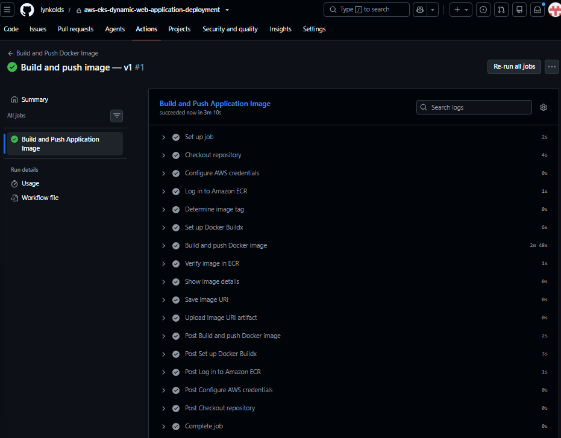

### Step 3: Deploy EKS

- Run **Deploy EKS Infrastructure** with the `apply` operation.

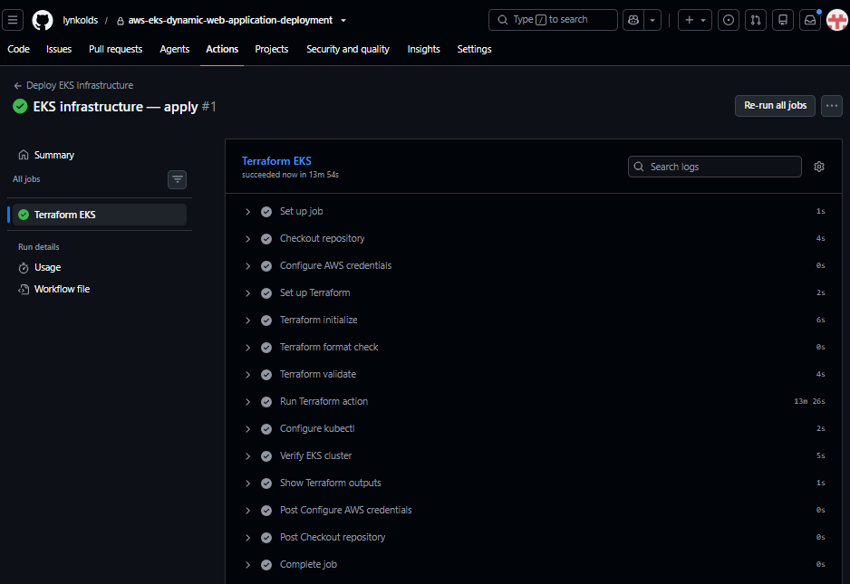


<p align="center">
  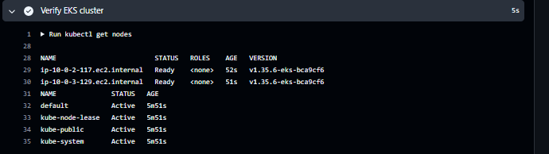
</p>

<p align="center">
  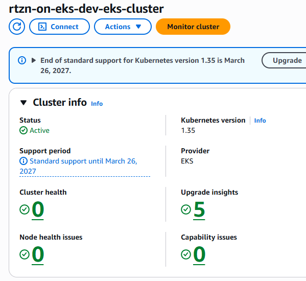
</p>


### Step 4: Install Platform Add-ons

- Run **Install EKS Platform Add-ons** with the `apply` operation.

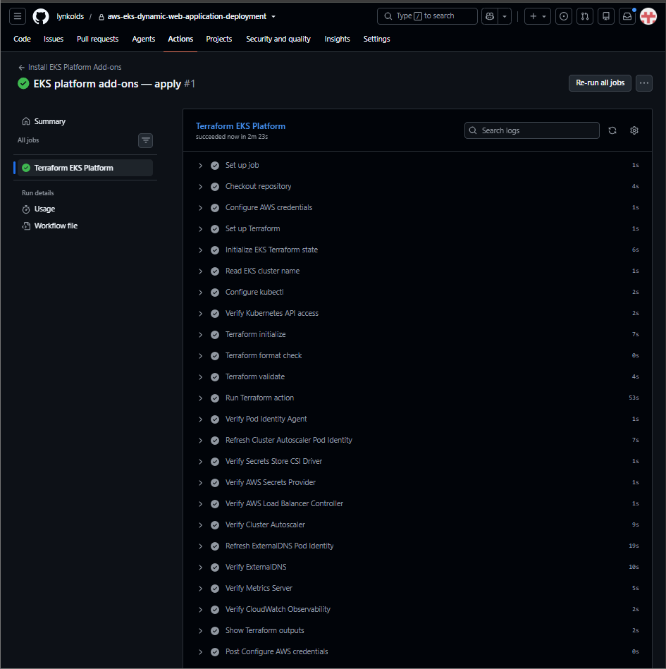

_The workflow verifies that all controllers, CSI components, the EKS Pod Identity Agent, ExternalDNS, Cluster Autoscaler, and observability components are installed and healthy._

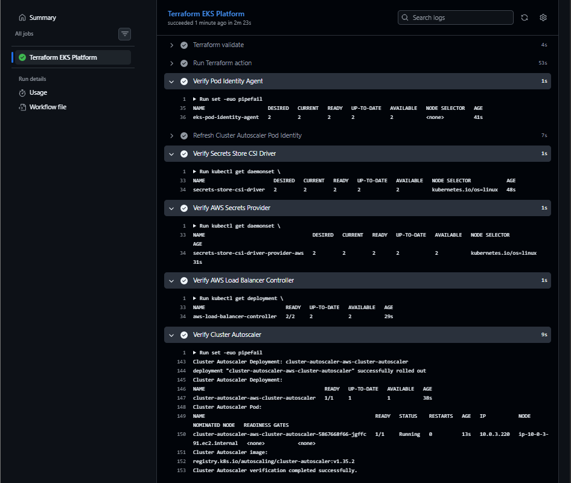

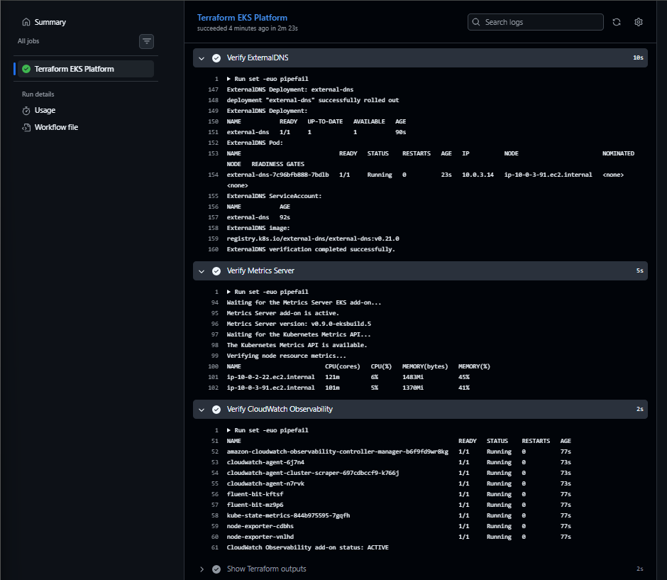


### Step 5: Populate the Application Secret

- Run **Populate Application Secret**.

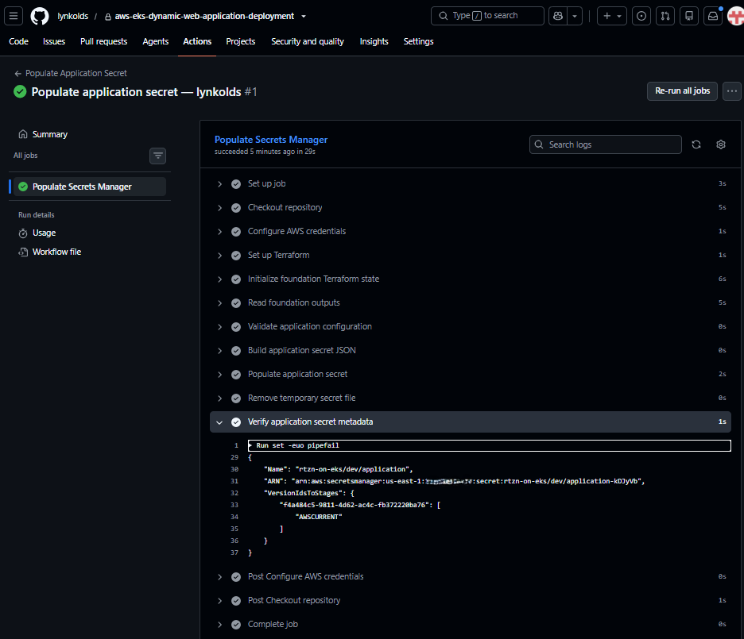

_Note that the workflow verifies the application secret’s metadata, ARN, and version stages without exposing any secret values._

### Step 6: Deploy the Application

- Run **Deploy EKS Application** with:

```text
operation = deploy
image_tag = <IMMUTABLE_IMAGE_TAG_FROM_THE_SECOND_WORKFLOW>
```

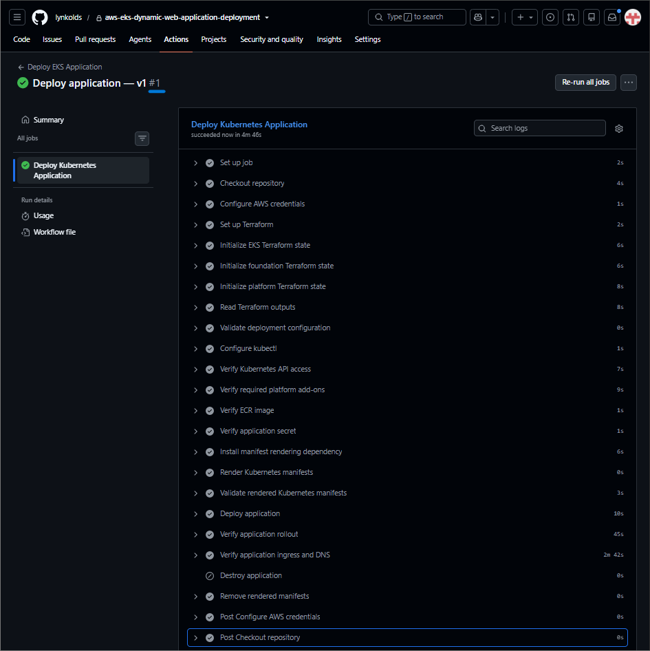

_The workflow verifies that all application resources and configurations were deployed successfully and are functioning as expected._
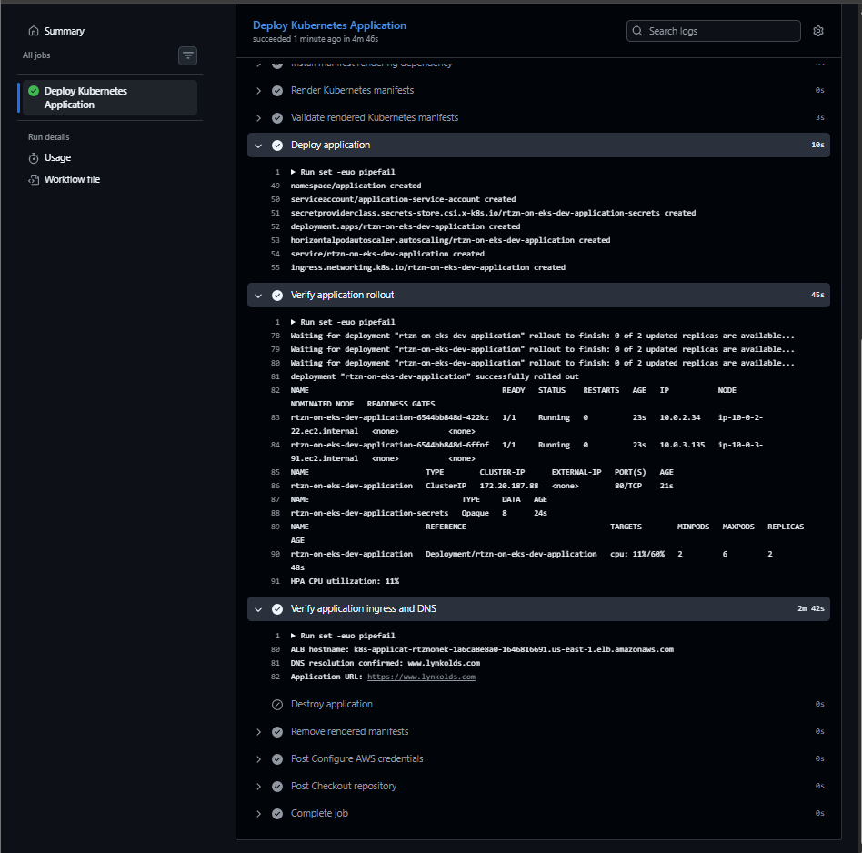

_The deployed web application loads successfully over HTTPS through the configured custom domain._
<p align="center">
  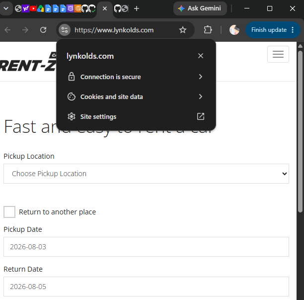
</p>

_Application load balancer targets are healthy_
<p align="center">
  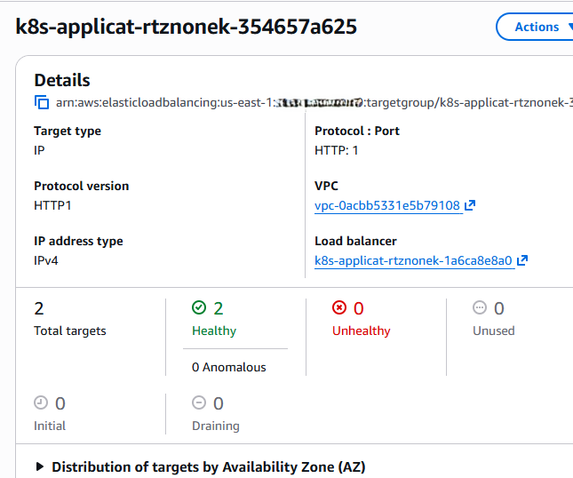
</p>

_Email to confirm SNS subscription_
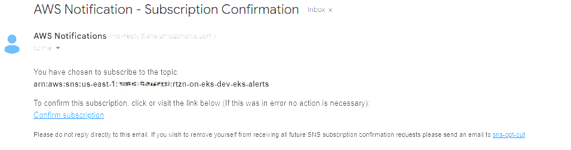


### Step 7: Replica Ownership Handoff

When `spec.replicas` is omitted during the initial creation of a Deployment, Kubernetes defaults the desired replica count to one.
 
To ensure the application starts with two Pods, the initial Deployment manifest includes:
```
spec:
  replicas: 2
```
After the Horizontal Pod Autoscaler (HPA) is installed and successfully managing the Deployment, `spec.replicas` must be removed from the Deployment manifest. Otherwise, every future `kubectl apply` operation can reset the replica count to the value stored in the manifest, temporarily conflicting with the HPA.

- Verify the HPA:

```powershell
kubectl get hpa -n <APPLICATION_NAMESPACE>
```

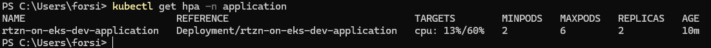

#### Complete the One-Time Replica Handoff

After confirming that the HPA is working, remove the fixed replica count from the Deployment’s `kubectl.kubernetes.io/last-applied-configuration` annotation.

```powershell
kubectl apply edit-last-applied deployment/<KUBERNETES_APP_NAME> -n <APPLICATION_NAMESPACE>
```

- In the editor, remove: 

```yaml
replicas: 2
```

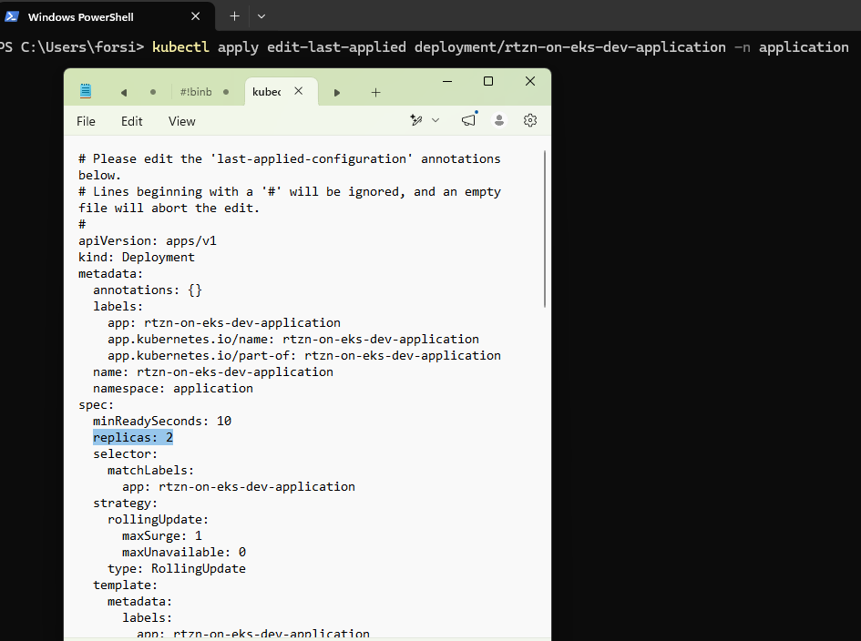

- Save and close the editor.

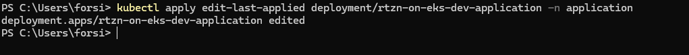


- Then remove the same line from:

```text
kubernetes/application/30-deployment.yaml
```

- Commit and push the manifest change, then run **Deploy EKS Application** again:

```text
operation = deploy
image_tag = <IMMUTABLE_IMAGE_TAG>
```
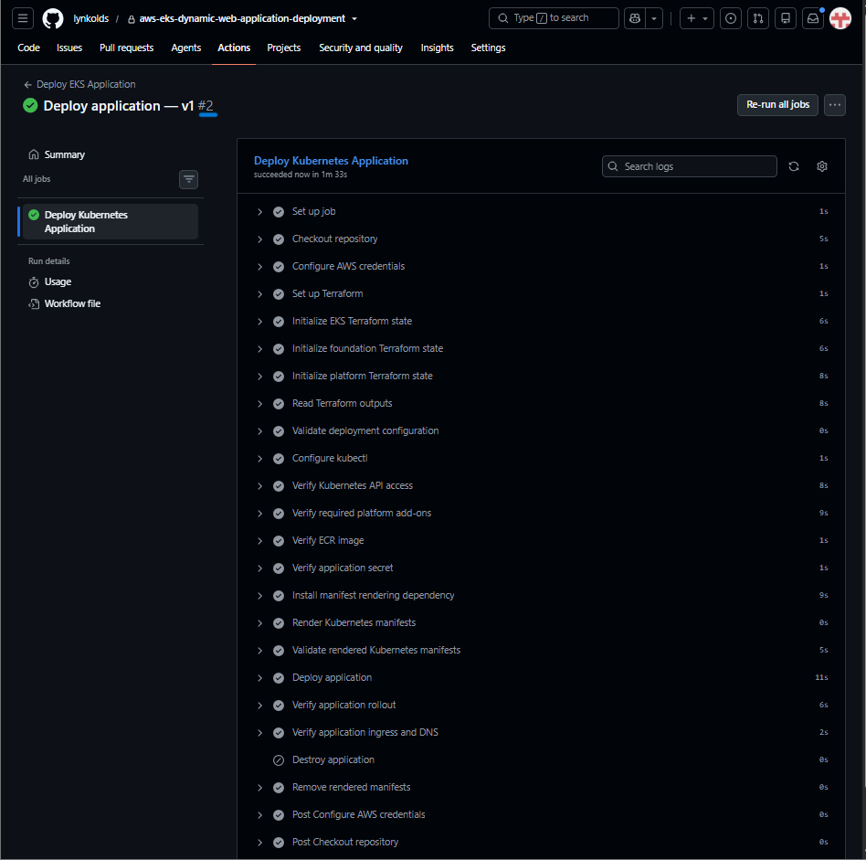 

- Verify that `kubectl apply` no longer manages a fixed replica count:

```powershell
kubectl apply view-last-applied deployment/<KUBERNETES_APP_NAME> -n <APPLICATION_NAMESPACE> -o yaml | Select-String "replicas:"
```
No output is expected. This confirms that `spec.replicas` is no longer part of the applied Deployment configuration and that replica management has been handed over to the Horizontal Pod Autoscaler.

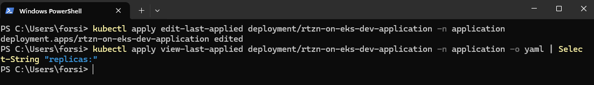

The same image tag may be reused for this one-time handoff because the container image is not being changed.

After this second run, the Deployment manifest no longer controls the replica count. The HPA manages the live replica count between 2 and 6 based on CPU utilization.

#### Future Application Deployments

For all future application releases:

1. Build and push the new image with a new immutable tag.
2. Run **Deploy EKS Application** once with that tag.
3. Allow Kubernetes to perform the rolling update.
4. Allow the HPA to continue managing the replica count.

```text
operation = deploy
image_tag = <NEW_IMMUTABLE_IMAGE_TAG>
```

Do not reintroduce `spec.replicas` into `30-deployment.yaml`. Otherwise, a future workflow run could temporarily reset the Deployment to a fixed replica count before the HPA adjusts it again.


## Troubleshooting Guide

> Generally, watch for trailing spaces when troubleshooting configuration values, environment variables, secrets, domain names, and resource names. Invisible trailing whitespace can cause failed comparisons, authentication issues, DNS mismatches, or resources to appear misconfigured even when the visible text looks correct.

### Local `kubectl` Access for an IAM User

An IAM user or role used from a local machine must be authorized to access the EKS cluster before `kubectl` can interact with Kubernetes resources.

The IAM principal should have:

* IAM permission for `eks:DescribeCluster`
* An **EKS access entry** for the IAM user or role
* An appropriate **EKS access policy** associated with that access entry, such as `AmazonEKSClusterAdminPolicy` when full cluster-administrator access is required
* AWS CLI credentials configured locally for that IAM principal

For example:

```powershell
aws eks update-kubeconfig --region us-east-1 --name <EKS_CLUSTER_NAME>
```

Then verify access:

```powershell
kubectl get nodes
```

> **Note:** EKS access policies provide Kubernetes permissions; they do not replace IAM permissions. The IAM principal still requires the necessary AWS IAM permissions, such as `eks:DescribeCluster`, to retrieve the cluster endpoint and certificate information.

### ExternalDNS Does Not Create a Record

Confirm:

- `domainFilters` contains the correct hosted-zone suffix, such as `example.com`
- `DOMAIN_NAME` contains the full application hostname, such as `www.example.com`
- The Ingress `spec.rules.host` contains the expected hostname
- The `external-dns.alpha.kubernetes.io/hostname` annotation contains the expected hostname
- The Ingress has an ALB hostname under `status.loadBalancer`
- The ExternalDNS Pod is running and has the required Route 53 IAM permissions
- `HOSTED_ZONE_ID` in the GitHub Environment variables contains the correct Route 53 hosted-zone ID
- `HOSTED_ZONE_NAME` in the GitHub Environment variables contains the correct hosted-zone name, such as `example.com`

### Application Returns HTTP 500 or 503

Common causes include:

- Application runtime and dependency incompatibility
- Missing `APP_ENV` or `APP_URL`
- Incorrect database key such as `DB_NAME` instead of `DB_DATABASE`
- Database connectivity or credentials
- Missing PHP or runtime extensions
- Storage permissions
- Incorrect health-check path

Check:

```powershell
kubectl describe pod <POD_NAME> -n <APPLICATION_NAMESPACE>
kubectl logs <POD_NAME> -n <APPLICATION_NAMESPACE> -c <CONTAINER_NAME> --tail=200
kubectl logs <POD_NAME> -n <APPLICATION_NAMESPACE> -c <CONTAINER_NAME> --previous --tail=200
```
The `--previous` command retrieves logs from the container's previous instance, which is particularly useful when troubleshooting a container that restarted or entered `CrashLoopBackOff`.


### Secret Values Do Not Refresh

- Verify the secret value at each layer:

```text
AWS Secrets Manager
-> synchronized Kubernetes Secret
-> environment variables inside the running Pod
```

After updating a value in AWS Secrets Manager:

- Confirm the **Populate Application Secret** workflow is not restoring or overwriting older values
- Confirm the live `SecretProviderClass` maps the expected secret keys
- Confirm the synchronized Kubernetes `Secret` contains the updated values
- Restart the Deployment so new Pods load the updated environment variables

```bash
kubectl rollout restart deployment <DEPLOYMENT_NAME> -n <APPLICATION_NAMESPACE>
```

Environment variables are read when a Pod starts, so existing Pods will not automatically receive updated Secret values.

### Page Loads Without CSS or JavaScript

- Check whether Laravel is generating asset URLs with `http://`:

```powershell
curl.exe -s https://www.example.com | Select-String -Pattern 'http://|stylesheet|script.*src|img.*src'
```
- Pay particular attention to `.github/workflows/5-populate-secrets.yml` and verify the production environment variables are set correctly:

```text
APP_ENV=production
APP_URL=https://www.example.com
```

`APP_URL` defines the application's public HTTPS URL. In this project, `APP_ENV=production` enables the production-only `URL::forceScheme('https')` logic, ensuring Laravel-generated URLs use HTTPS.

Because the ALB terminates HTTPS before forwarding requests to the application, this HTTPS-forcing logic prevents Laravel from generating `http://` asset URLs in production.

## Cost and Operational Considerations

The main recurring cost drivers are:

- EKS cluster control plane
- EC2 instances in the managed node group
- NAT Gateways and data processing
- RDS instance and storage
- ALB usage
- CloudWatch logs and Container Insights metrics
- ECR image storage
- Route 53 hosted zone and DNS queries
- Secrets Manager secret storage and API calls

Use resource limits, log retention, ECR lifecycle rules, autoscaling limits, and intentional cleanup to control cost.

## Security and Reliability Practices

- Use GitHub OIDC instead of long-lived AWS access keys
- Apply least-privilege IAM policies
- Store sensitive values in GitHub Environment secrets and AWS Secrets Manager
- Keep EKS worker nodes and RDS in private subnets
- Expose only the ALB through public subnets
- Use HTTPS and redirect all HTTP traffic
- Use immutable image tags
- Scan ECR images on push
- Separate Terraform state by root module
- Enable S3 versioning and state locking
- Use EKS access entries instead of manually editing `aws-auth`
- Use EKS Pod Identity for supported workloads
- Validate rendered Kubernetes manifests before modifying live resources
- Require an image tag before deployment
- Use startup, readiness, and liveness probes
- Confirm SNS subscriptions and test alarm delivery
- Do not commit `.tfstate`, `.tfvars`, secret values, rendered manifests, or local kubeconfig files

## Cleanup

Destroy resources in the reverse order of creation:

```text
1. Destroy EKS Application
2. Destroy Platform Add-ons
3. Destroy EKS Infrastructure
4. Destroy Foundation Infrastructure
5. Destroy Bootstrap Infrastructure only when the state bucket and OIDC role are no longer needed
```

Before destroying the application, use the application workflow with:

```text
operation = destroy
```

Before destroying protected RDS resources, update and apply the Terraform lifecycle configuration deliberately. Do not remove database protection without confirming the snapshot and retention requirements.

The ExternalDNS policy determines how DNS records behave during cleanup. With `upsert-only`, records can remain after the Ingress is deleted and may require manual removal. A `sync` policy can remove records automatically but grants ExternalDNS broader deletion behavior.

## Future Improvements

- Infrastructure and application policy checks in CI
- Automated Terraform formatting and validation on pull requests
- Image vulnerability gates before deployment
- Dedicated nonproduction environment
- Pod Disruption Budgets
- Network policies
- AWS WAF on the ALB
- Centralized audit and security findings
- Automated database migration job
- Blue/green or canary deployment strategy
- Automated backup restore testing
- Automated DNS and HTTPS smoke tests
